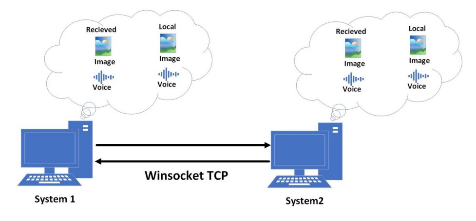

# MultiMedia-HW1

## Image-Voice Chat

In the first part of this project we have an application that can capture an **image** of the webcam and a **30s audio**, then send it to the destination PC using **`TCP/IP`**.

### Prerequisites
for this code to work, you need to install a couple of libraries:
* openCV (cv2)
* socket
* numpy
* pyaudio
* wave
* threading
* pyQT5

for installing any of the libraries above, you should open your termnial (for instance VScode terminal) and enter `pip install <library name>` e.g. `pip install cv2`

### How it works

**1. Webcam Capture and Image Editing:** The application displays the webcam feed using `OpenCV`. Users can capture an image from the webcam, which is then displayed in a separate window. Additionally, there's an option to edit the captured image using the `Gamma Correction method`, which adjusts the brightness of the image. `Gamma correction` is implemented using `NumPy`.

**2. Audio Recording:** The application can record audio for 30 seconds using the `PyAudio` library. The recorded audio is saved as a WAV file.

**3. Sending and Receiving Data:** Data transmission is handled through separate `server.py` and `client.py` scripts using the `socket` library for `TCP/IP` communication. The server script creates a TCP/IP server, and the client script exchanges data packets with the server on specified ports (21200 for images and 21300 for audio). Multithreading is utilized to prevent freezing of the application, especially during data transmission.

**4. User Interface:** The UI is designed using `PyQt5`, featuring buttons for capturing images, recording audio, playing recorded audio, and sending/receiving data. Additionally, there's a timer display for tracking the recording duration.
   
### How to use

* Starting the Application: Run the main script `main.py`. The application window will open, displaying the webcam feed.

* Capturing an Image: Click the "Capture" button to take a snapshot from the webcam. The captured image will be displayed in a separate window. Optionally, adjust the image brightness using the provided trackbars.

* Recording Audio: Click the "Record" button to start recording audio. The recording duration is limited to 30 seconds. A timer will display the elapsed recording time.

* Playing Recorded Audio: After recording audio, click the "Play Audio" button to listen to the recorded audio.

* Sending and Receiving Data: Before sending data, click the "Receive" button to start the server. Then, click the "Send" button to initiate data transmission.

**Note**: Ensure that you first click "Receive" and then "Send" for proper functionality, as the server needs to be created before data transmission.

## Wireless Communication & Command**
